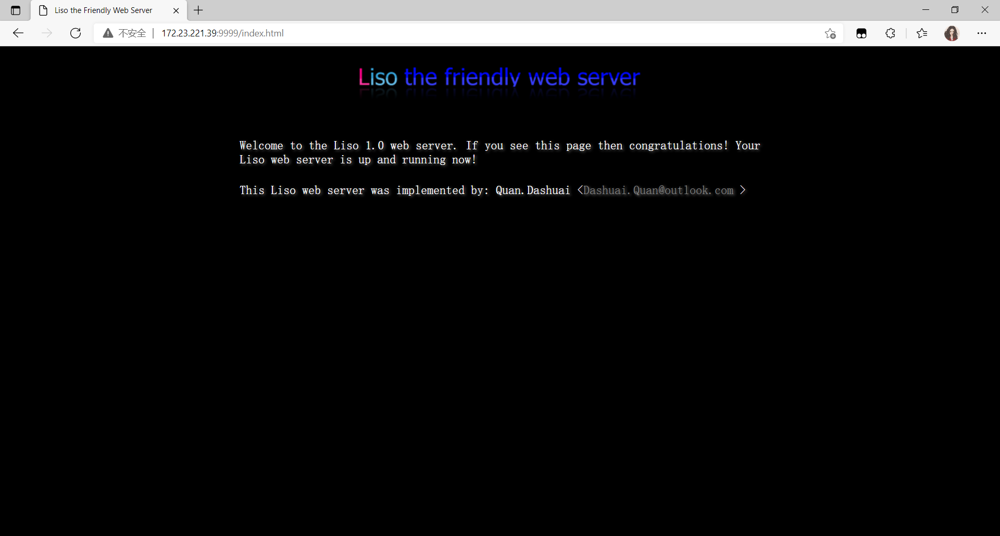
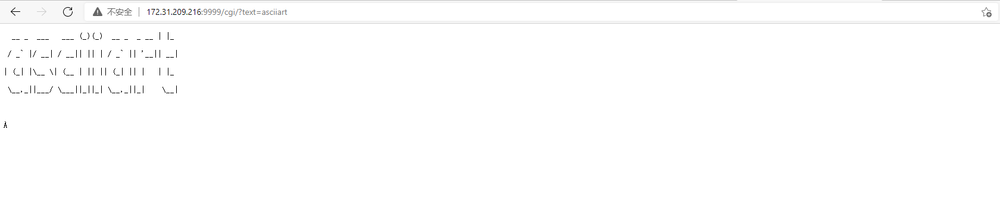
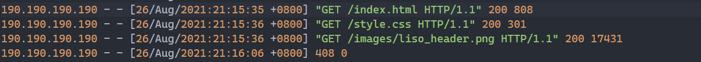

# httpserver

A simple HTTP server written in C that runs on GNU/Linux.

- [httpserver](#httpserver)
  - [Feature](#feature)
  - [Build](#build)
  - [Run](#run)
    - [Static page](#static-page)
    - [CGI & POST](#cgi--post)
    - [Log](#log)
  - [Benchmark](#benchmark)

## Feature

- [√] HTTP/1.1 support only
- [√] Using epoll for concurrency
- [√] Support GET, HEAD, POST
- [√] Keep-Alive support
- [√] Support many status codes, including 200, 400, 404, 408, 500, 501, 505
- [√] Can handle timeout connections
- [√] CGI support
- [√] Simple Logging
  - The log format: [Apache Log](https://httpd.apache.org/docs/2.4/logs.html)

## Build

``` bash
cmake -Bbuild -DCMAKE_BUILD_TYPE=Debug
cd build && make
```

## Run

``` bash
cd build
./server --http=9999 --log=test.log --www=../static_site --cgi=../cgi
```

### Static page



### CGI & POST

Note: You need to install art first, like `pip3 install art`.

TODO(dashuai): Long strings will cause memory leak.

**URL: 127.0.0.1:9999/cgi/?text=asciiart**



### Log



## Benchmark

Apache Bench(Short Link)


Apache Bench(Long Link)


