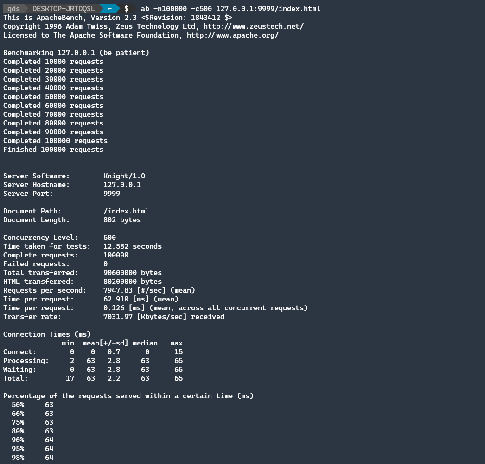
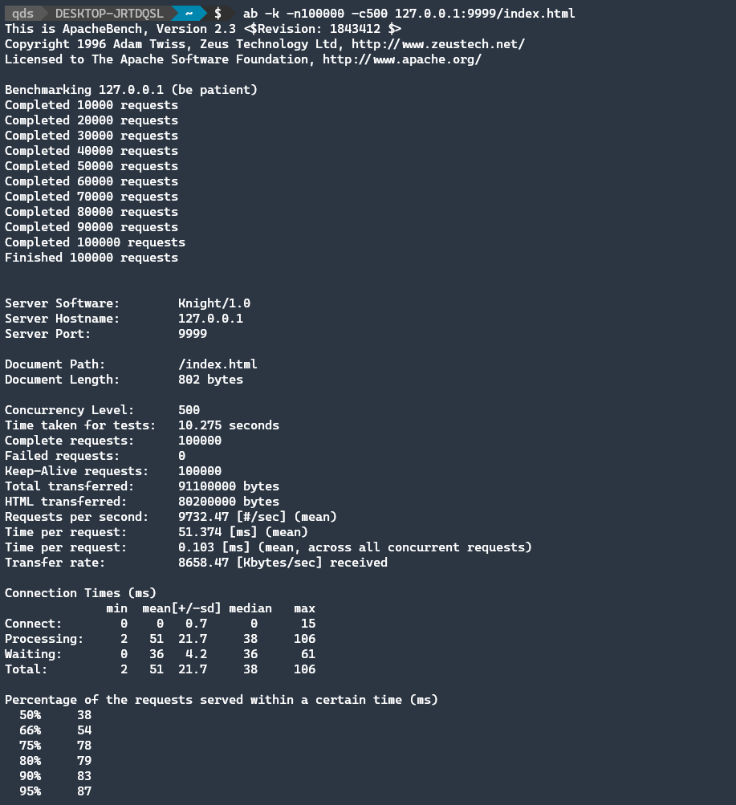
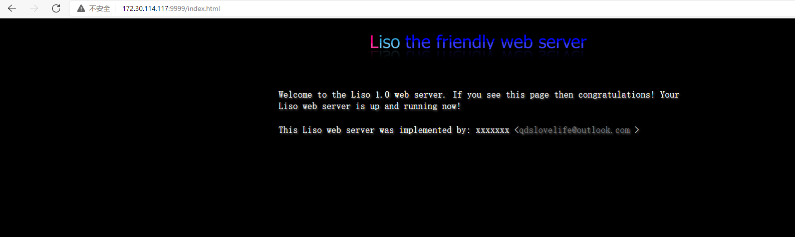

# httpserver


一个用C编写的可在GNU/Linux上运行的简易HTTP服务器。

## 特性

- [√] 仅支持HTTP/1.1
- [√] 使用epoll实现并发
- [√] 支持GET、HEAD
- [√] 支持CGI
- [√] 支持Keep-Alive
- [√] 支持多个状态码，包括200、400、404、408、500、501、505
- [√] 可以处理超时连接
- [√] 简单的日志功能(Release模式下的日志有bug)
- [×] 支持TLS

## 构建

``` cmake
cmake -Bbuild -DCMAKE_BUILD_TYPE=Release
cd build && make
```

## 运行

``` bash
# 在build目录下
./server --http=9999 --log=<你的日志文件> --www=<你的静态内容的目录，末尾不加/>
```

## 测试

启动HTTP服务器


Apache Bench短链接



Apache Bench长连接



浏览器测试


